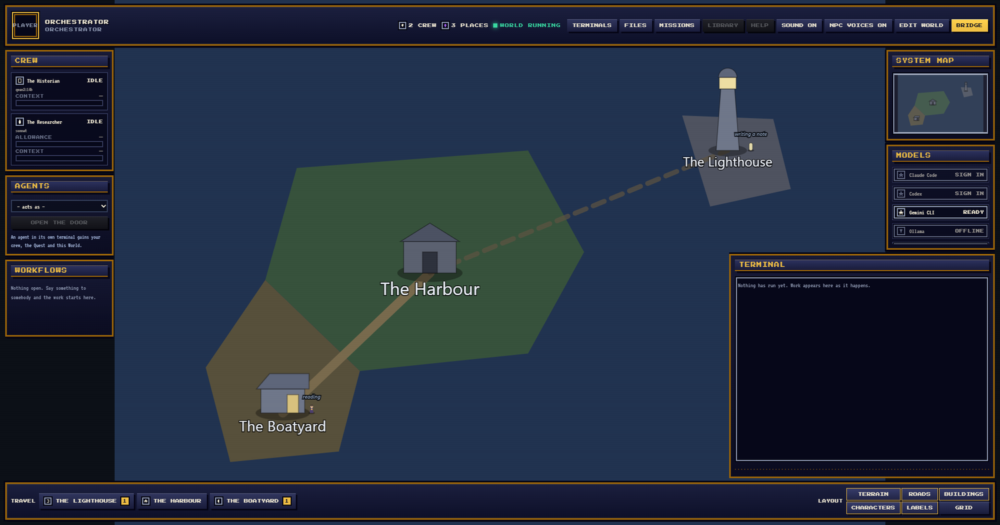
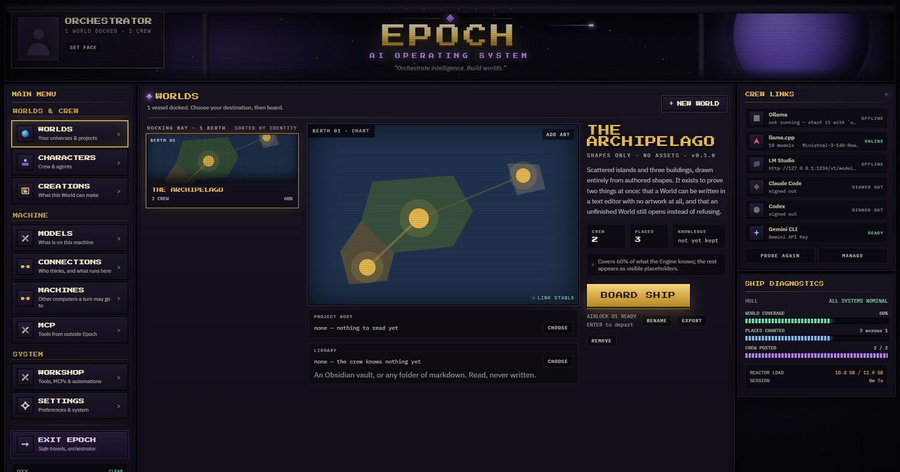
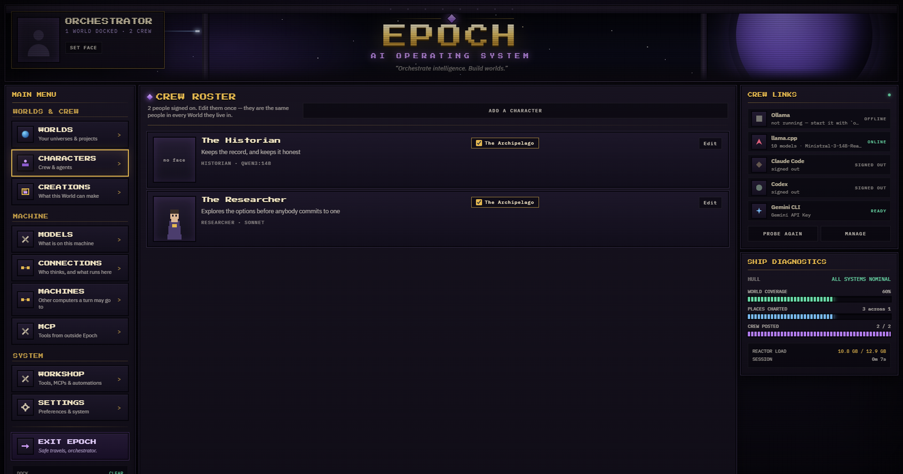
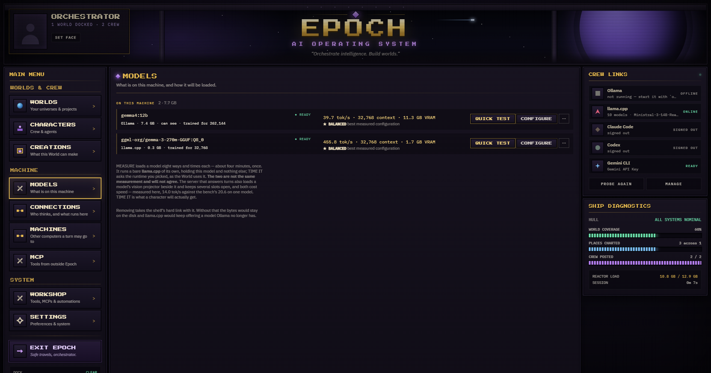
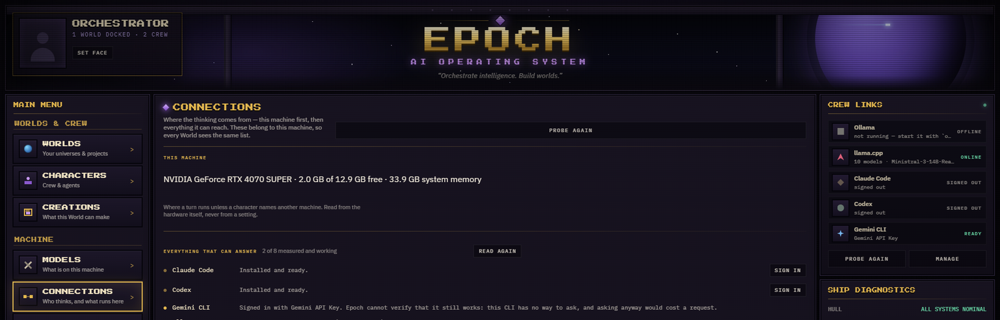
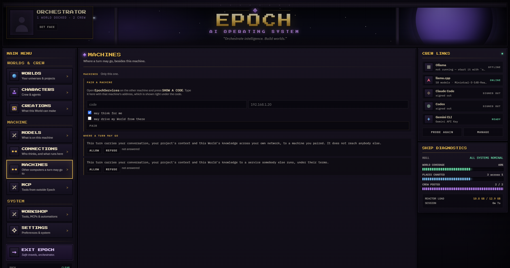
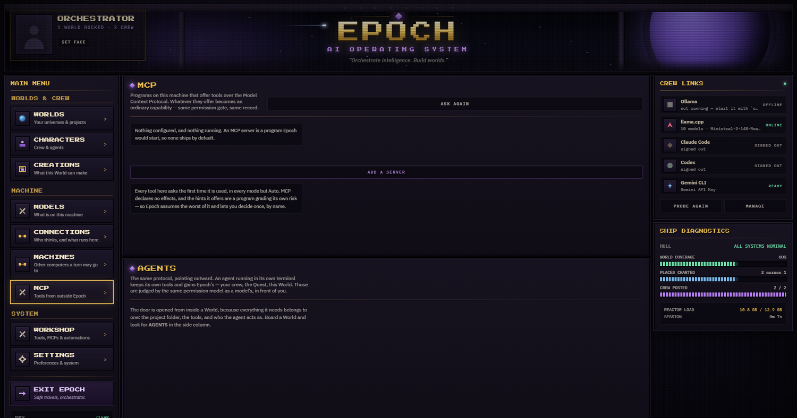
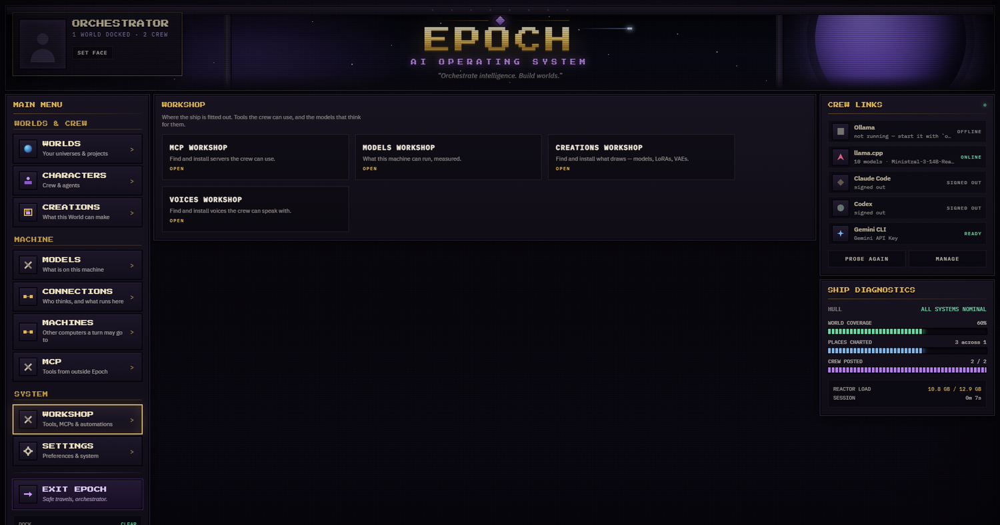
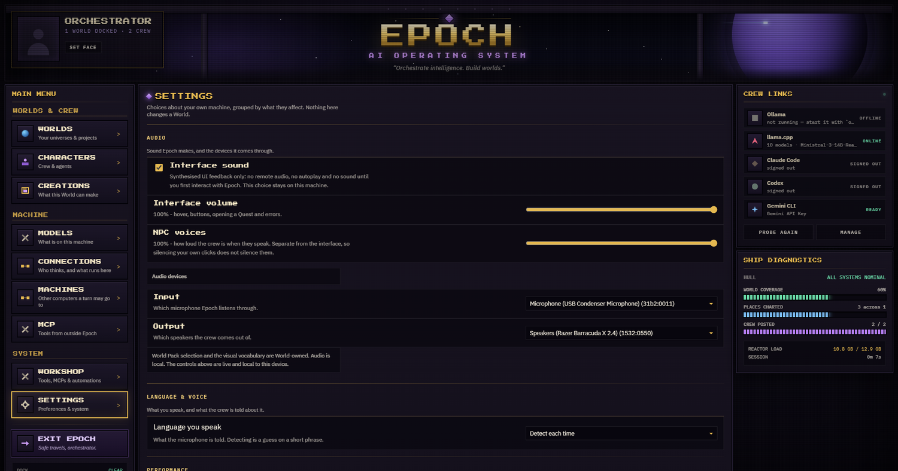

<div align="center">

# Epoch

**An AI operating system that is a place, not a dashboard.**

*Orchestrate intelligence. Build worlds.*

[](LICENSE)
[](#getting-it)
[](#how-it-is-built)
[](https://github.com/KislokX/Epoch/actions/workflows/ci.yml)

</div>



---

## What Epoch is

Most AI tools are a text box with a history. Epoch is a **world you enter**.

Your crew are characters who live somewhere. They have faces, routines and a place
they stand in. When one of them is thinking, you can see where. When nothing is
running, the world is quiet — and that quiet is true, not a spinner.

Underneath, it is an engine: local models, hosted models, coding agents, image,
video, sound and 3D generation, MCP servers, and the machines on your network —
all behind one way of working. You never learn Docker, YAML or a node graph.

> **North star: AI should never be harder to use than a video game.**

*Above: inside a World. Three places, roads between them, and two of the crew
where they actually are — one writing a note at the Lighthouse, one reading at the
Boatyard, because nothing has been asked of either yet.*

---

# The bridge

You do not start in a chat. You start on the **bridge of a docked ship**: nine
decks, each answering one question about your setup. Everything below is
configured here, in the product, with no file to edit.

<br>

## `WORLDS` — your universes and projects



A **World** is a project with a place attached. It has a map, buildings, roads and
a crew who live in it. The docking bay runs down the left; the World you selected
takes the rest.

Each World holds two folders you choose and Epoch never guesses:

| | |
|---|---|
| **Project root** | where the crew actually works — your real codebase, read the way a coding agent reads it |
| **Library** | an Obsidian vault or any folder of markdown. **Read, never written** |

They are deliberately separate. One folder for both would mean pointing a World at
your notes in order to read them, and thereby handing `write_file` the same folder
— a permission decision made silently by a convenience.

`BOARD SHIP` takes you in. Hold Shift to skip the departure sequence: immersion
must never cost you time.

<br>

## `CHARACTERS` — the crew, and they are yours



A character is a **portable asset**, not a row in a settings table: name, face,
sprite, role, prompt, parameters, and which Worlds they live in. Edit them once and
they are the same person everywhere.

What you configure per character:

- **Brain** — a local model, Claude Code, Codex, Gemini CLI, or a model on another
  machine you paired. Change it and they stay themselves; the model is
  infrastructure, the character is the product.
- **Temperature, top-p, context, reasoning effort** — behavioural identity. A
  Guardian at 0.2 and a Researcher at 0.9 differ in *who they are*.
- **Voice, and who they sound like** — a Piper voice, optionally converted.
- **Sprite and icon** — imported from your own files. Epoch names the file from its
  bytes, never from what it was called.
- **Routine** — what they do when nobody has asked them anything.

The checkboxes on each row move somebody between Worlds. It applies immediately,
because moving somebody should not depend on remembering to save a form.

<br>

## `CREATIONS` — what this World can make, and what it makes it with

Pictures, video, sound and 3D, through ComfyUI on this machine or on one you
paired. Epoch starts it, finds what is installed, and gets out of the way.

- **Styles** are yours to name. A Style exists because a workflow serves it — take
  the last workflow away and the Style goes with it. Epoch never reads a name off
  a file and decides what your *pixel art* means.
- **The library** is one folder Epoch adds as a search path. It **never moves,
  copies or renames** a file you already had.
- **Workflows** are imported, and what each can do is derived from the graph —
  whether it can do image-to-image is answered by whether a `LoadImage` is in it,
  never by a manifest that could lie.
- **Speaking** lives here too: Piper for the mouth, whisper.cpp for the ear, and
  the forge that turns a downloaded voice into one Epoch can run.

Asking a character for a picture opens the **Studio Panel** — a form, never a node
graph. You pick the model, the LoRAs, the ControlNets, the size and the prompt from
what is actually installed, read by hash. Nothing is chosen for you.

<br>

## `MODELS` — what is on this machine, measured



Every model you have, with numbers Epoch took rather than numbers it guessed:
measured tokens per second, the context it was measured at, the memory it actually
took, and which configuration won.

- `BENCHMARK & OPTIMIZE` runs a real search — eight configurations, timed — and
  writes the winner as a profile.
- `QUICK TEST` is the cheap question once the expensive one has an answer.
- `⋯` opens flash attention, cache type, speculation and the draft model.

A model nobody has measured **shows no numbers at all**, because a plausible number
is worse than a blank one.

<br>

## `CONNECTIONS` — who thinks, and what runs here



This machine first, then everything it can reach. Ollama, llama.cpp and LM Studio
are found if they are installed and configured without asking you twice. Every row
says whether it is installed, whether it is serving, and where it was found.

You can also add **any server speaking the OpenAI API** at any address, and hosted
models with a key you supply. Keys are encrypted for your operating system account
and never enter a World Pack or an export — the type that would carry one does not
exist.

Coding agents appear here too. Epoch opens the agent's own sign-in **in the agent's
own window** and never sees the credential. Two accounts of the same agent are two
separate sign-ins, isolated properly.

<br>

## `MACHINES` — where else a turn may go



Pair another computer running [EpochServices](https://github.com/KislokX/epochservices)
and its models become brains your crew can use. Pairing is a code, typed once,
spent the moment it works. No account, no cloud.

Two grants, asked separately because they are separate questions:

- **may think for me** — a turn may run there
- **may drive my World from there** — that machine may act on this World

And two disclosures Epoch will not decide for you: whether a turn may carry your
conversation and your project's context **across your own network**, and whether it
may carry them **to a service somebody else runs**. Both start unanswered.

<br>

## `MCP` — tools from outside Epoch



Connect any MCP server and its tools become things your crew can reach, under
Epoch's own Trust policy. Epoch also *is* an MCP server: a coding agent connected
to it gains your crew, the Quest and its Chronicle, this World's knowledge, and the
servers already configured here.

**Epoch adds tools; it does not take them away.** It does not govern an agent's own
`Read`, `Write` or `Bash` — those are better than Epoch's, and pretending otherwise
made Epoch a toll rather than a door. It governs its own, and it says so.

<br>

## `WORKSHOP` — fitting the ship out



Four shelves, one way of asking: search, weigh against this machine, install.

| | |
|---|---|
| **Models** | Hugging Face and Ollama. Ordered by downloads, never by an invented score |
| **Creations** | checkpoints, LoRAs, VAEs, ControlNets from Hugging Face and Civitai |
| **Voices** | 175 Piper voices across 56 locales, with a sample to hear first |
| **MCP** | servers the crew can use |

Every row says whether it **fits**: the real byte count of that quantisation against
this card's memory. On Apple Silicon it says so in the vocabulary of one memory
pool, because that is what the machine has.

Epoch never installs anything on a character's say-so. Fetching fourteen gigabytes
is not a decision a tool call makes.

<br>

## `SETTINGS` — your machine, grouped by what it affects



Six groups, each with one sentence saying what it changes. Nothing here changes a
World.

| | |
|---|---|
| **Audio** | interface sound, two separate volumes, input and output devices |
| **Language & voice** | what you speak, so the ear is told rather than guessing |
| **Performance** | whether several crew stay loaded at once, and how many tool rounds one turn may take |
| **Downloads** | which machines may put a model on disk, and the one catalogue key that needs one |
| **Stored data** | what Epoch keeps, and how to clear it |
| **Security** | regenerate the credential agents use to reach Epoch's tools |

The two volumes are separate on purpose: muting your own clicks must never silence
your crew.

---

## Quests own the work

You do not delegate a task to an AI. You start a **Quest**, and it carries
everything — the goal, the decisions, the files, the accepted plan, the artifacts —
from one specialist to the next. A character *inaugurates* a Quest rather than
creating it: the work exists from the moment you say what you want.

History is built from evidence. A Quest that produced nothing says so, and failure
is an outcome that gets remembered rather than an exception that gets hidden:
Blocked, Rejected, Abandoned, Failed, Needs Revision — each with the whole story.

Handoffs have visible causes. Exactly three things move a Quest: the previous
specialist finished, the runtime advanced it on state, or **you** approved the next
stage. No surface may fabricate timing.

---

## Principles this is actually built on

These are enforced in the code, not aspirations in a README.

- **A gauge with nothing behind it must read empty.** A panel with no measurement
  keeps its frame, loses its light and says which subsystem will light it.
- **A gate with nothing behind it must stay open.** Reading silence as *no* is the
  same invention as reading it as *yes*; it merely fails in the direction that
  looks responsible.
- **Derived, never declared.** A capability somebody typed into a manifest is one
  that will eventually lie.
- **Measured, not remembered.** Somebody else's command-line flag is a measurement
  with an expiry date. Epoch asks the program.
- **Epoch opens the door and never holds the key.** No password field, nothing read
  back, no token stored.
- **The engine owns reality; the UI owns animation.** Nothing on screen is invented
  to look alive.
- **Internal first.** Every subsystem speaks canonical domain models. Everything
  else is a projection.

Written down in [`CLAUDE.md`](CLAUDE.md), the project's constitution, alongside
every defect that produced them.

---

## How it is built

| | |
|---|---|
| Engine | Rust — a zero-I/O kernel, an engine, and surfaces over it |
| Surface | Tauri 2 + React + TypeScript |
| Tests | Rust and TypeScript suites, on Windows **and** macOS, on every commit |
| Dependencies | permissive licences only, enforced by `cargo deny` in CI |

```
BUILD/crates/epoch-kernel     canonical types, zero I/O, depends on nothing
BUILD/crates/epoch-engine     providers, capabilities, quests, knowledge, simulation
BUILD/crates/epoch-models     what a machine can run, and what a model costs there
BUILD/crates/epoch-assets     what a file is, read from its own bytes
BUILD/crates/epoch-secrets    where a credential is kept, per operating system
BUILD/crates/epoch-wire       how two machines speak, and how each knows the other
BUILD/crates/epoch-tauri      the desktop surface
BUILD/crates/epoch-setup      the installer
BUILD/ui                      the Launcher and the World
```

The architecture is documented in ADRs under [`docs/ADR`](docs/ADR) — 30-odd
decisions, each with the evidence that forced it.

---

## Getting it

Windows, for now. Two files on the [Releases](../../releases) page and one of them is the one to
take:

| | |
|---|---|
| **`epoch-setup.exe`** | The one to download. It carries Epoch inside it and offers what this machine does not have yet — a local runtime, a voice, the parts a first run needs. Decline all of them and Epoch still opens, and says what is missing. |
| `Epoch_x.y.z_x64-setup.exe` | The plain installer, for somebody who wants only the application. |

It installs **per user**, into `%LOCALAPPDATA%\Epoch`, and keeps its vault and its model library
in `%APPDATA%\Epoch`. Uninstalling leaves both alone unless the *delete the application data* box
is ticked, which does exactly what it says.

macOS and Linux builds are not published yet. The code is cross-platform and the release matrix
is not; that is stated here rather than promised.

### Checking what you downloaded

Epoch is **unsigned**, and that is a decision rather than an omission: a code-signing certificate
is a recurring cost and it buys *who made this*, which is the half a stranger can least act on.
The half they can check is free, and it ships with every release.

```
sha256sum -c SHA256SUMS
gh attestation verify epoch-setup.exe --repo KislokX/Epoch
```

The first says the file you have is the file the build produced. The second says that file came
from this commit of this repository, built on GitHub's own runners, signed through a public
transparency log — so a tampered installer cannot claim to have come from here, whatever it is
called and wherever it was downloaded from.

**Neither of them stops SmartScreen.** Nothing but reputation or an EV certificate does, and a
README that implied otherwise would be the invented gauge in prose. Windows will warn about an
unrecognised app; *More info* → *Run anyway* is the way past it, and the two commands above are
how you decide whether you want to.

The `.cdx.json` files beside them are CycloneDX parts lists — one for the application, one for
setup, one for the frontend. They exist for the day an advisory lands on something in the tree
and somebody needs to know whether this build contained it.

## Building from source

```bash
git clone https://github.com/KislokX/Epoch
cd epoch/BUILD/ui
npm install
npm run world:build
```

Needs Rust (stable) and Node 20+. Tests:

```bash
cd BUILD && cargo test --workspace
cd ui && npx vitest run
```

The two Worlds that ship carry **no artwork at all** — they are drawn from authored
shapes, which is a state the engine is built for. Bring your own with `ADD ART` on
the bridge.

---

## Related

**EpochServices** — the companion that turns another computer on your network into a machine
your crew can think on: it lends that machine's models over a paired, encrypted connection, and
Epoch shows them as brains a character can be given. **Not published yet**, so there is no link
here rather than a link to nothing.

---

## Licence

Apache-2.0. See [LICENSE](LICENSE) and [NOTICE](NOTICE), which lists every program
Epoch can install for you and the licence each one keeps. Epoch distributes none of
them — it fetches them from their own publishers, the way you would have.
