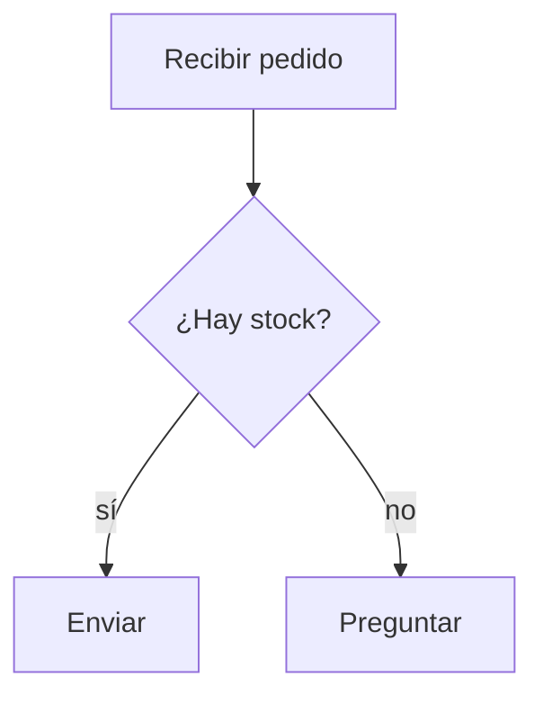

# Rich Chronicle

> Estado: **entrega 1 implementada** · dueña: Fase 4, UI como capa de presentación.

El Chronicle conserva el texto exacto que dijeron el usuario y los personajes. **Rich Chronicle**
no cambia ese registro ni le pide a un proveedor una respuesta propietaria: interpreta una
gramática pequeña después de leerlo y la proyecta igual para Claude, Codex, Ollama y cualquier
Provider posterior.

## Lo que la persona ve

- Encabezados, listas, negritas, código y tablas Markdown se vuelven legibles dentro de la
  conversación.
- Un bloque `flow` o un subconjunto común de `mermaid` se ve como cajas y flechas.
- Una dirección `http` o `https` abre el navegador nativo mediante el shell que ya valida el
  esquema.

Esto sirve para revisar una comparación, un plan o una decisión antes de crear un archivo real.
Una tabla visible **no es** todavía un libro Excel: crear, editar o exportar `.xlsx` pertenece a
la Skill correspondiente de Fase 5, con permiso, archivo y evidencia.

## Gramática deliberadamente pequeña

Se admiten solo:

```md
### Encabezado
- una lista
1. una lista ordenada
**negrita** y `código`
| Columna | Otra |
| --- | --- |
| valor | valor |
```

Y para flujos:



No se procesa HTML, SVG, JavaScript ni un intérprete Mermaid de terceros. Todo lo que no entre
en esa gramática se presenta como texto o como bloque de código. Esa restricción evita que una
salida de modelo ejecute o inyecte contenido en la aplicación.

## Siguiente corte

La entrega actual da el vocabulario visual común. Los siguientes pasos son: adjuntos con
procedencia, una revisión de accesibilidad de teclado y la compactación especializada para
Providers de modelo. La creación de archivos —Excel incluido— espera a Skills para conservar el
modelo de permisos de Epoch.
